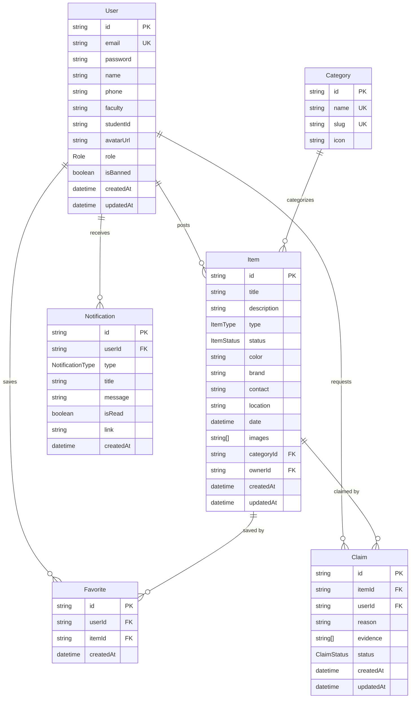

# ER Diagram — Lost & Found Hub

## Enums
- **Role**: `USER`, `ADMIN`
- **ItemType**: `LOST`, `FOUND`
- **ItemStatus**: `LOST`, `FOUND`, `RETURNED`
- **ClaimStatus**: `PENDING`, `APPROVED`, `REJECTED`
- **NotificationType**: `CLAIM_REQUESTED`, `CLAIM_APPROVED`, `CLAIM_REJECTED`, `ITEM_RETURNED`
